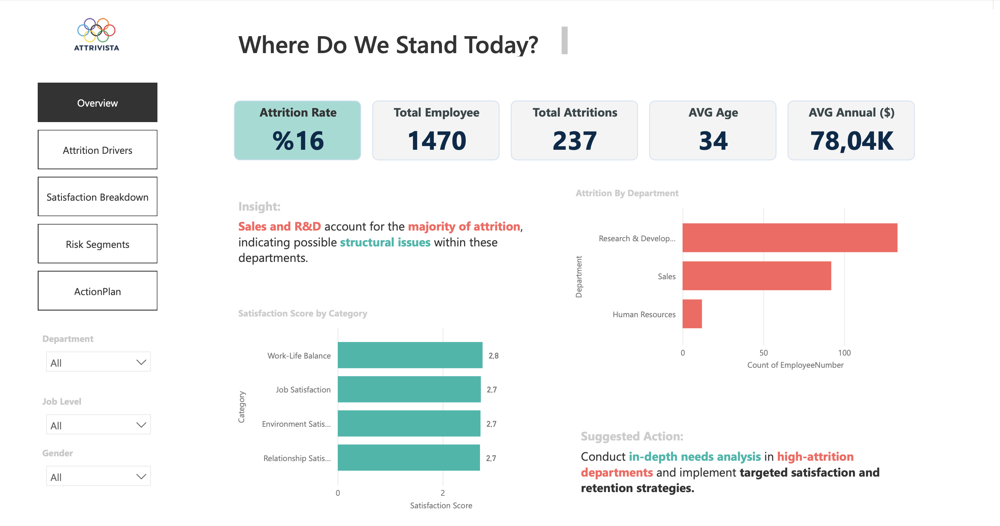

# Attrivista | HR Attrition Analytics Dashboard

## Overview
...# hr-attrition-analytics
HR Attrition Analysis Dashboard built with Power BI and Python-based data analysis.
## Overview
## Dashboard Preview
## Business Problem

Employee attrition is one of the most critical challenges for organizations, as high turnover leads to increased recruitment costs, knowledge loss, and decreased productivity.

The objective of this project is to analyze employee attrition patterns and identify the key drivers behind workforce turnover.

Using HR data, the analysis aims to answer the following questions:

- Which employee segments are most likely to leave the company?
- What organizational factors contribute to attrition?
- How do satisfaction levels impact employee retention?
- Which departments face the highest turnover risk?
- What proactive actions can HR teams take to reduce attrition?

By transforming workforce data into actionable insights, this project aims to support HR leaders in designing more effective employee retention strategies.
## Project Objectives
## Analytical Approach (CRISP-DM)

The project follows the CRISP-DM (Cross Industry Standard Process for Data Mining) methodology to structure the analytical workflow.

### 1. Business Understanding
The main goal is to understand employee attrition patterns and identify actionable insights that can help organizations improve employee retention.

### 2. Data Understanding
The dataset includes employee demographic information, job-related attributes, satisfaction scores, and tenure information.

Key variables analyzed include:

- Department
- Job Level
- Years at Company
- Satisfaction Scores
- Education Field
- Marital Status
- Age Groups

### 3. Data Preparation
Data preparation involved:

- Data cleaning and validation
- Creating tenure groups
- Segmenting employees by demographic and organizational attributes
- Preparing aggregated metrics for dashboard visualization

### 4. Data Analysis & Visualization
Using Power BI, multiple analytical perspectives were created:

- Attrition distribution across departments
- Attrition by tenure and job level
- Satisfaction score breakdown
- High-risk employee segments
- Workforce demographic analysis

### 5. Insight Generation
Key insights identified include:

- Attrition peaks during the first 3 years of employment
- Entry-level roles experience significantly higher turnover
- Sales and R&D departments show elevated attrition
- Lower satisfaction scores correlate with higher attrition

### 6. Business Recommendations
Based on the analysis, several strategic recommendations were proposed:

- Implement structured onboarding programs
- Develop mentorship initiatives for early-career employees
- Improve communication and role clarity in high-risk departments
- Introduce flexible work policies to support work-life balance

These insights support proactive HR strategies to improve employee retention.
## Project Impact

This project demonstrates how HR analytics can transform workforce data into strategic insights. By identifying attrition drivers and high-risk segments, organizations can design targeted retention strategies and improve employee experience.

Action today ensures retention tomorrow.
## Dashboard Report

You can view the full project report here:

[Download the Dashboard Report](hr-attrition-dashboard.pdf)

